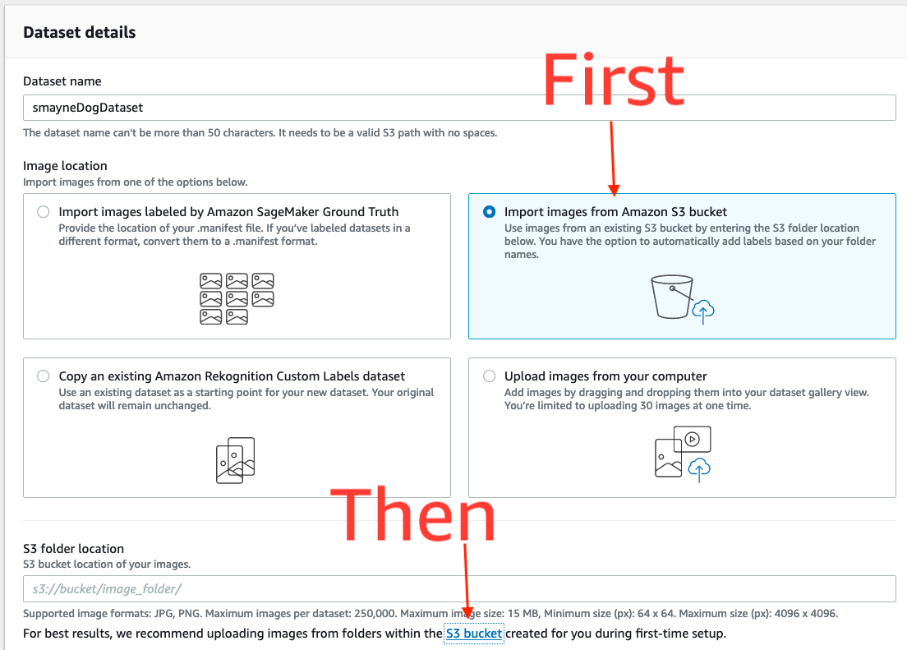
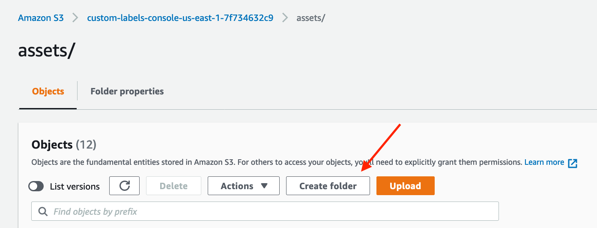
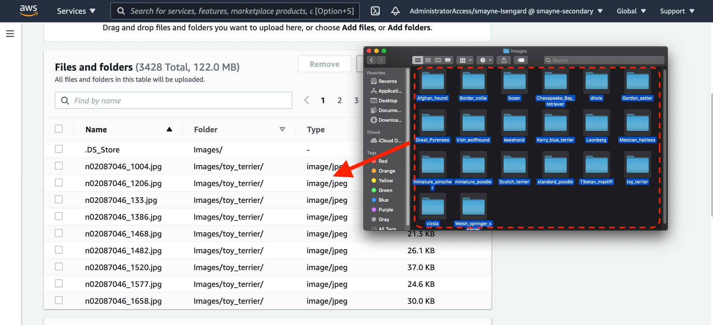
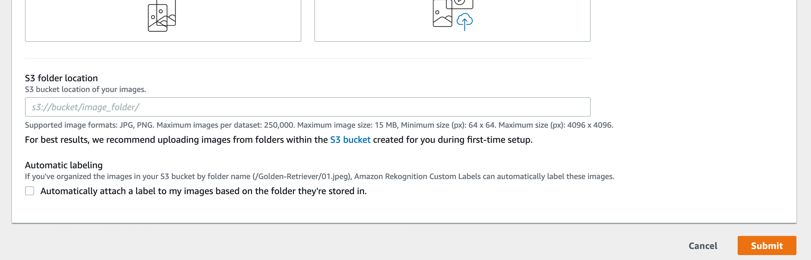
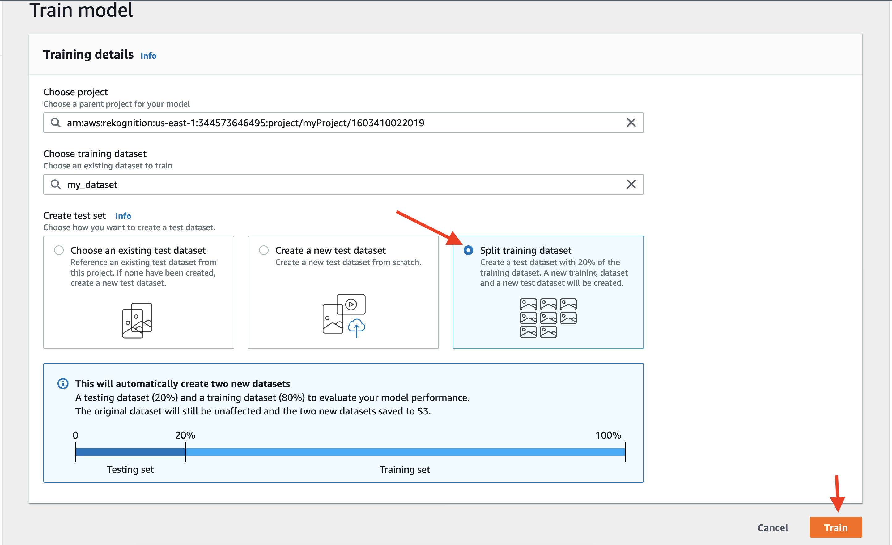
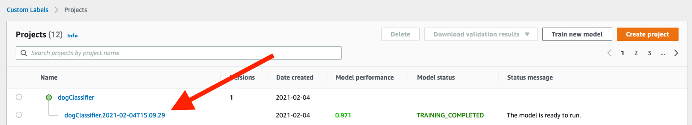

# Custom Labels Lab!

## In todays lab we will be created an Amazon Rekognition Custom Labels model to identify different lego

1) Open to the Rekognition service page in the AWS Console
2) Then Navigate to the Custom Labels page by clicking the link on the left hand side. (If you don't see any left hand links, press the "hamburger" icon in the top left of the page)

3) When you first navigate to the custom labels page, it will prompt you to create an S3 bucket. Go ahead and select "Create S3 bucket"

4) You'll want to select "Getting Started." Or, if you don't see the "Getting Started" option, Select "Projects" from the left hand menu, and then select "Create Project"

5) Name your project a valid name, the select "Create Project"

6) Once your project has been created, you'll need to create a dataset. 

There are several different ways to create datasets, including uploading and labeling directly in the console.
However, in this case we will upload our images to S3. You'll want to select the option for "Import images from S3 bucket" and then hit the link for "S3 bucket" at the bottom of the page.
This will take you to the S3 folder where you can upload your images.

7) Now you'll want to upload your images. You can upload the unzipped images that are located in this github repository.

8) You can select the folders containing the images, and then drag and drop them into your S3 bucket.

9) Once the upload has completed, you can copy the file path from the top of the page. This path should end in the root folder for the dataset.

10) Paste the filepath from you clipboard. You'll also want to check the checkbox for "Automatically attach a label to my images based on the folder they're stored in."

11) Now your images are loaded into your dataset. You'll notice the labels were already created based on the folder structure of your data.
Now you'll want to train your model based on this data.

12) When on the train model screen, your model should already be pre-populated. You'll need to choose the dataset you just created, and then click the option for "Split Data Set."
This will automatically reserve 20% of your dataset to the side, and use it to evaulate the performance of you model.

13) Then you'll want to select "Train." The training process will take at least an hour.

14) Once your model has been trained, you can click the name to view more information.

15) From the model detail screen, you can see information about the overall performance of the model, as well as performance on each individual class of images.
You can click the botton for "View Test Result" to see more detaied info.

16) Here you can see each image, and whether or not it was correctly labeled.

17) You can also select specific outcomes. Here you can see the example of the false positives.

18) If you wish to start your model, you can go back to the model detail page and find the CLI commands. Be aware that starting your model will cause it to start occuring costs.

