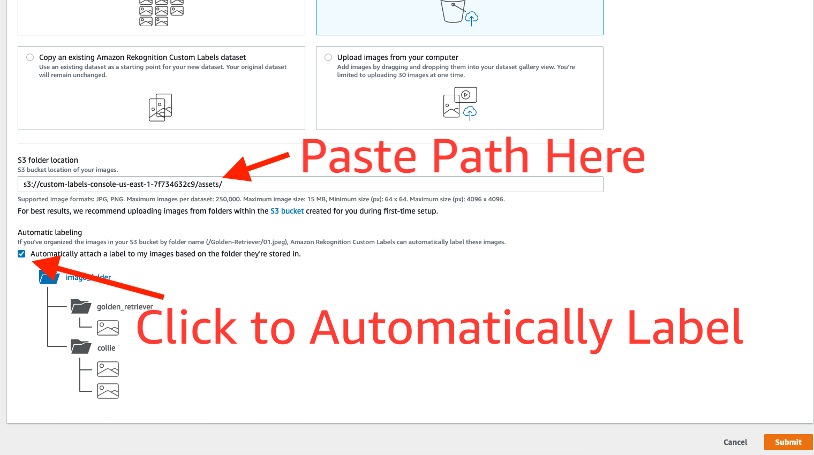

# Custom Labels Lab!

## In todays lab we will be created an Amazon Rekognition Custom Labels model to identify whether a car is a BMW or Mercedes

1) Open to the Rekognition service page in the AWS Console

2) Then Navigate to the Custom Labels page by clicking the link on the left hand side. (If you don't see any left hand links, press the "hamburger" icon in the top left of the page)
3) When you first navigate to the custom labels page, it will prompt you to create an S3 bucket. Go ahead and select "Create S3 bucket"

4) You'll want to select "Getting Started." Or, if you don't see the "Getting Started" option, Select "Projects" from the left hand menu, and then select "Create Project"
5) Name your project a valid name

6) Once your project has been created, you'll need to create a dataset. Select "Create Dataset"

7) Then give your dataset a name, and select "Upload images from your computer"

8) Now you've created your dataset, we need to create our labels. Select "add labels" on the left hand side

9) We have two labels for this project "BMW" and "Mercedes"

10) Now we need to add images, lets start with the BMW images. Select "add images" and then drag and drop the images from the BMW folder

11) New we label our images. If you aren't already in "Labelling mode" (it will tell you at the top), then select the option to enter labelling mode

12) Select all of our images, and the hit "Assign Labels"

13) Add the BMW label

14) Complete this same process for the Mercedes Images
15) Complete this process for the "Both" folder, applying both Mercedes and BMW labels. (Not you'll have to apply them one at a time)
16) Go back to the "Projects Page," and select to "Train New Model"

17) Select to use your dataset that you've just created, and then choose "Split Training Set"

18) Then hit train model! Wait for your model to train, and then you can view your results.